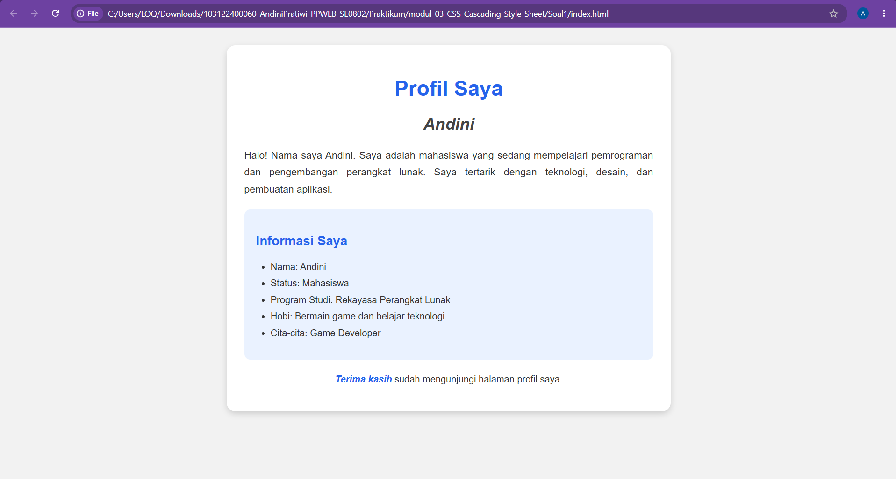
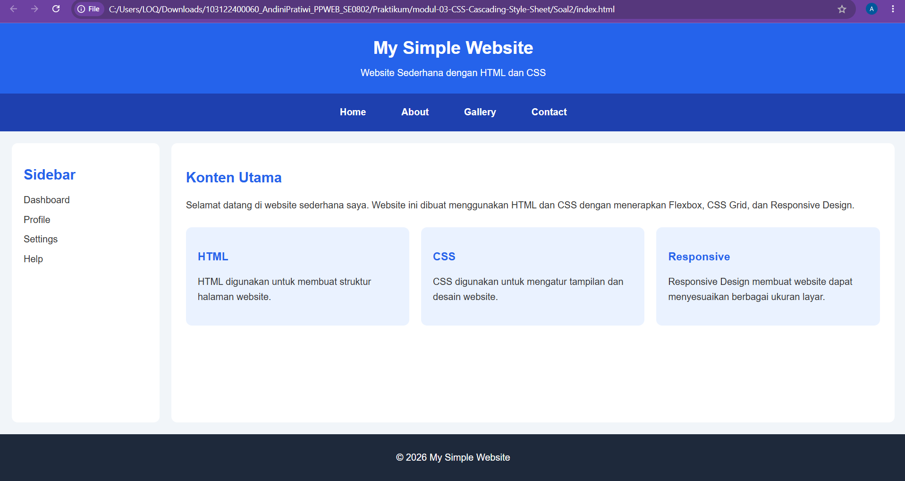

# Tugas Praktikum 03: CSS

**Nama:** Andini Pratiwi  
**NIM:** 103122400060  
**Kelas:** SE-08-02  
**Dosen Pengampu:** Arif Amrulloh  

## Soal
Kerjakan kedua latihan berikut menggunakan HTML dan CSS. Buat file index.html dan gunakan CSS sesuai materi yang telah dipelajari (Selector, Font Properties, List, Alignment, Color, Div & Span, Flexbox, Grid, dan Responsive Design).   
**Soal 1 - Membuat Halaman Profil Sederhana dengan CSS**  
Buat sebuah halaman profil sederhana menggunakan HTML dan CSS dengan ketentuan berikut:
1. Buat judul halaman menggunakan heading dan atur menggunakan CSS Selector.
2. Buat bagian profil menggunakan elemen. 

3. Gunakan Font Properties untuk mengatur:
   - jenis font
   - ukuran teks
   - ketebalan teks
   - gaya teks
4. Buat daftar informasi menggunakan list (`<ul>` atau `<ol>`) dan berikan styling CSS.
5. Atur warna background dan warna teks menggunakan CSS Colors.
6. Atur posisi teks menggunakan Text Alignment.

Output yang diharapkan:  
Terdapat halaman profil dengan judul, deskripsi, daftar informasi, dan tampilan yang sudah diberi styling CSS.   
**Soal 2 - Membuat Layout Website Responsive**  
Buat sebuah layout website sederhana menggunakan Flexbox, CSS Grid, dan Responsive Design dengan ketentuan berikut:
1. Buat navbar yang berisi minimal tiga menu menggunakan Flexbox.
2. Buat layout halaman yang terdiri dari:
   - Header
   - Sidebar
   - Konten utama
   - Footer
3. Gunakan CSS Grid untuk mengatur struktur layout halaman.
4. Tambahkan warna, padding, dan jarak antar elemen agar tampilan lebih rapi.
5. Gunakan Media Query agar tampilan berubah ketika dibuka pada layar tablet dan smartphone.  

Ketentuan responsive:
- Desktop: tampilkan menu secara horizontal dan layout beberapa kolom.
- Tablet: sesuaikan ukuran kolom agar lebih kecil.
- Mobile: ubah tampilan menjadi satu kolom dan menu menjadi vertikal.

Output yang diharapkan:
- Website sederhana yang dapat menyesuaikan tampilan pada laptop, tablet, dan smartphone. 

**Keterangan Pengumpulan**  
Kumpulkan file project HTML dan CSS yang telah dibuat.
Pastikan kode dapat dijalankan menggunakan browser atau Live Server pada Visual Studio Code.

## Program/Kode
Soal 1 tersedia di [Soal1_index.html](<Soal 1/index.html>) dan [Soal1_style.css](<Soal 1/style.css>). 
Soal 2 tersedia di [Soal2_index.html](<Soal 2/index.html>) dan [Soal2_style.css](<Soal 2/style.css>).

## Output

## Deskripsi
Pada praktikum ini dilakukan pembuatan dua halaman website sederhana menggunakan HTML dan CSS. Praktikum bertujuan untuk memahami dan menerapkan beberapa konsep dasar CSS dalam mengatur tampilan dan tata letak halaman web.  

**Pada Soal 1** dibuat halaman profil sederhana yang terdiri dari judul, deskripsi, dan daftar informasi. Styling yang diterapkan meliputi CSS Selector, Font Properties, List, Text Alignment, Color, Div, dan Span. Penggunaan `<ul>` dan `<li>` berfungsi untuk menampilkan daftar informasi profil agar lebih terstruktur dan mudah dibaca. CSS digunakan untuk mengatur jenis dan ukuran font, warna teks dan background, posisi teks, serta tampilan daftar agar halaman profil terlihat lebih rapi.  

**Pada Soal 2** dibuat layout website responsive yang terdiri dari Header, Navbar, Sidebar, Konten Utama, dan Footer. Flexbox digunakan untuk mengatur posisi menu pada Navbar, sedangkan CSS Grid digunakan untuk mengatur struktur layout Sidebar dan Konten Utama. Selain itu, diterapkan Media Query untuk membuat tampilan website dapat menyesuaikan ukuran layar desktop, tablet, dan smartphone. Pada Sidebar juga digunakan `<ul>` dan `<li>` untuk menyusun menu secara terstruktur.  

Melalui praktikum ini, dapat dipahami bagaimana HTML digunakan untuk membangun struktur halaman dan CSS digunakan untuk mengatur tampilan, tata letak, daftar informasi, serta responsivitas sebuah website.